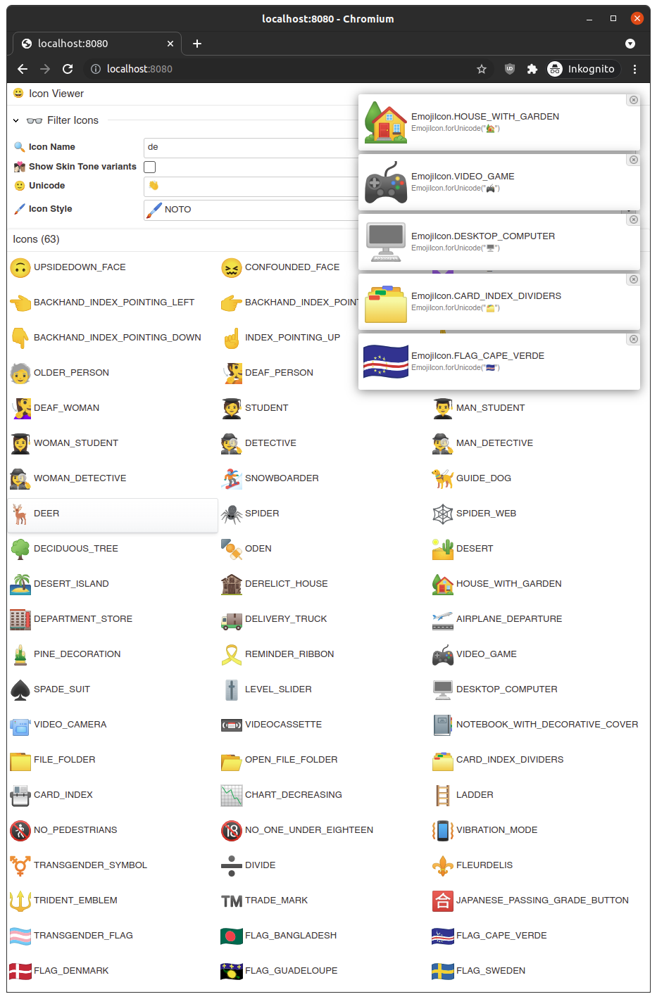

# TeamApps Emoji Icon Library

Use Emojis in your TeamApps Application UI

This library provides 1816 icons (3521 incl. skin tone variants) in 5 different styles.

This is the full set of the [Unicode Emoji List Version 13.1](https://www.unicode.org/emoji/charts-13.1/emoji-list.html)

* Noto from Google
* Noto Black
* Twemoji From Twitter
* OpenMoji
* OpenMoji Black

## Usage

Add dependency to your TeamApps Maven Project:

~~~xml
        <dependency>
            <groupId>org.teamapps</groupId>
            <artifactId>teamapps-emoji-icon-provider</artifactId>
            <version>1.0</version>
        </dependency>
~~~

Usage:

~~~java
import org.teamapps.icon.emoji.EmojiIcon;
import org.teamapps.icon.emoji.EmojiIconStyle;
import org.teamapps.icons.Icon;

public class IconExample {
    public static Void someMethod() {
        Icon smile = EmojiIcon.GRINNING_FACE;
        Icon icon_with_skintone = EmojiIcon.RAISED_HAND__LIGHT_SKIN_TONE.withStyle(EmojiIconStyle.OPENMOJI_COLOR);
        Icon flag = EmojiIcon.FLAG_GERMANY.withStyle(EmojiIconStyle.TWEMOJI);
        
        // Get Icon by Emoji as unicode String
        Icon wavingHand = EmojiIcon.forUnicode("👋");
    }
}
~~~

## Emoji Icon Browser

This Project includes a visual Icon Browser.

Launch it quickly from your Teamapps project.

`Component emojiIconBrowser = new EmojiIconBrowser(sessionContext).getUI();`

You can copy the following complete IconBrowser class. Run it and point your browser to <http://localhost:8082>

~~~java
import org.teamapps.icon.emoji.EmojiIconBrowser;
import org.teamapps.server.jetty.embedded.TeamAppsJettyEmbeddedServer;
import org.teamapps.ux.component.Component;
import org.teamapps.ux.component.rootpanel.RootPanel;
import org.teamapps.webcontroller.WebController;

public class IconBrowser {
    public static void main(String[] args) throws Exception {
        WebController controller = sessionContext -> {
            RootPanel rootPanel = new RootPanel();
            sessionContext.addRootPanel(null, rootPanel);
            Component emojiIconBrowser = new EmojiIconBrowser(sessionContext).getUI();
            rootPanel.setContent(emojiIconBrowser);
        };
        new TeamAppsJettyEmbeddedServer(controller, 8082).start();
    }
}
~~~

## SVG Sources

This Icon Library contains SVG Icons of following Open Source Emoji Icon sets:

### Noto

Google Font https://github.com/googlefonts/noto-emoji

Tools and most image resources are under the [Apache license, version 2.0](https://github.com/googlefonts/noto-emoji/blob/main/LICENSE). Flag images under third_party/region-flags are in the public domain or otherwise exempt from copyright (more info).

### Noto Black

Adobe SVG Font Project https://github.com/adobe-fonts/noto-emoji-svg based on
Google Font https://github.com/googlefonts/noto-emoji

Tools and most image resources are under the [Apache license, version 2.0](https://github.com/googlefonts/noto-emoji/blob/main/LICENSE). Flag images under third_party/region-flags are in the public domain or otherwise exempt from copyright (more info).

###  OpenMoji

* https://openmoji.org/
* https://emojis.wiki/openmoji/

OpenMoji graphics are licensed under the Creative Commons Share Alike License 4.0 [(CC BY-SA 4.0)](https://creativecommons.org/licenses/by-sa/4.0/)

### Twemoji from Twitter

* https://twemoji.twitter.com/

Graphics licensed under [CC-BY 4.0](https://creativecommons.org/licenses/by/4.0/)

#### Requirements (from Twemoji)

##### Attribution

As an open source project, attribution is critical from a legal, practical and motivational perspective in our opinion. The graphics are licensed under the CC-BY 4.0 which has a pretty good guide on best practices for attribution.

However, we consider the guide a bit onerous and as a project, will accept a mention in a project README or an 'About' section or footer on a website. In mobile applications, a common place would be in the Settings/About section (for example, see the mobile Twitter application Settings->About->Legal section). We would consider a mention in the HTML/JS source sufficient also.

##### Licensing

Copyright 2020 Twitter, Inc and other contributors  
Code licensed under the MIT License: http://opensource.org/licenses/MIT  
Graphics licensed under CC-BY 4.0: https://creativecommons.org/licenses/by/4.0/

## General Information about Emoji 

### Emoji Lists & Metadata

* emoji-test.txt http://unicode.org/Public/emoji/
* Complete Lists and Metadata https://github.com/Mange/emoji-data/
* Java Library for Handling emoji in Text https://github.com/vdurmont/emoji-java/

## Dev Notes

### Get icon files

The svg file assets are stored in [src/main/resources/org/teamapps/icon/emoji/](./src/main/resources/org/teamapps/icon/emoji/)

* NOTO:
  * Download noto-emoji (currently branch svg_flags2) https://github.com/googlefonts/noto-emoji/tree/svg_flags2
  * Run scrip in src/main/resources/org/teamapps/icon/emoji/noto/import-noto.sh
* NOTO_BLACK:
  * Download Release Asset (Source code) from https://github.com/adobe-fonts/noto-emoji-svg
  * extract `svg_bw` and `flag_bw`
* TWEMOJI
  * Download Release Asset (Source code) from https://github.com/twitter/twemoji/releases
  * extract assets/svg
* OPENMOJI
  * Download and extract sets from: https://github.com/hfg-gmuend/openmoji/releases
  
### generate EmojiIcon Entries

The EmojiIcon entries are generated based on [emoji-test.txt](project-resources/emoji-test.txt) using a python script

The [emoji-test.txt](project-resources/emoji-test.txt) file was obtained from http://unicode.org/Public/emoji/

~~~bash
cd project-resources
python3 generate_java_entries.py -J
~~~

Then copy the entries from [emoji.java](project-resources/emoji.java) to [EmojiIcon.java](src/main/java/org/teamapps/icon/emoji/EmojiIcon.java)

## TEAMAPPS SOFTWARE LICENSE

Apache 2.0

## ICONS LICENSE

The graphics are licenced under a free license, but some require attribution.

### Emoji Licensing

* https://emojipedia.org/licensing/
* http://unicode.org/emoji/images.html
* https://blog.emojipedia.org/who-owns-emoji/
